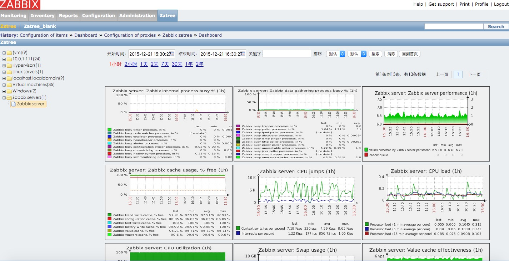

#安装方法  
此版本为Zabbix2.2.11和Zatree 二合一版本   
```
#git  clone  https://github.com/itnihao/zatree-2.2.git  
#mv /usr/share/zabbix /usr/share/zabbix-bak  
#cp -r zatree-2.2 /usr/share/zabbix  
#vim /usr/share/zabbix/conf/zabbix.conf.php  
```
```
<?php                                                                                                                             
    // Zabbix GUI configuration file
    global $DB;
 
    $DB['TYPE'] = 'MYSQL';
    $DB['SERVER'] = '127.0.0.1';    //修改为您的DB地址
 
    $DB['PORT'] = '3306';
    $DB['DATABASE'] = 'zabbix';
    $DB['USER'] = 'zabbix';
    $DB['PASSWORD'] = 'zabbix';
 
    // SCHEMA is relevant only for IBM_DB2 database
    $DB['SCHEMA'] = '';
 
    $ZBX_SERVER = '10.0.1.112';
    $ZBX_SERVER_PORT = '10051';
    $ZBX_SERVER_NAME = '';
 
    $IMAGE_FORMAT_DEFAULT = IMAGE_FORMAT_PNG;
```
安装后效果如下 
 

#优化记录
1.将调用外部API的方式改为内置API方式，解决卡死问题和速度缓慢问题   
2.将默认24小时数据记录改为1个小时 
3.将风格改为Zabbix内置样式 

